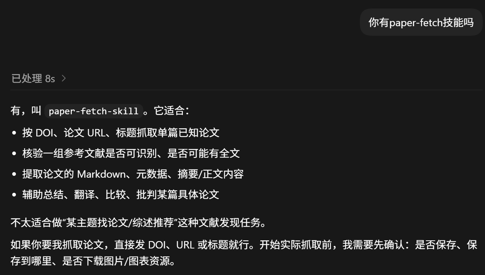
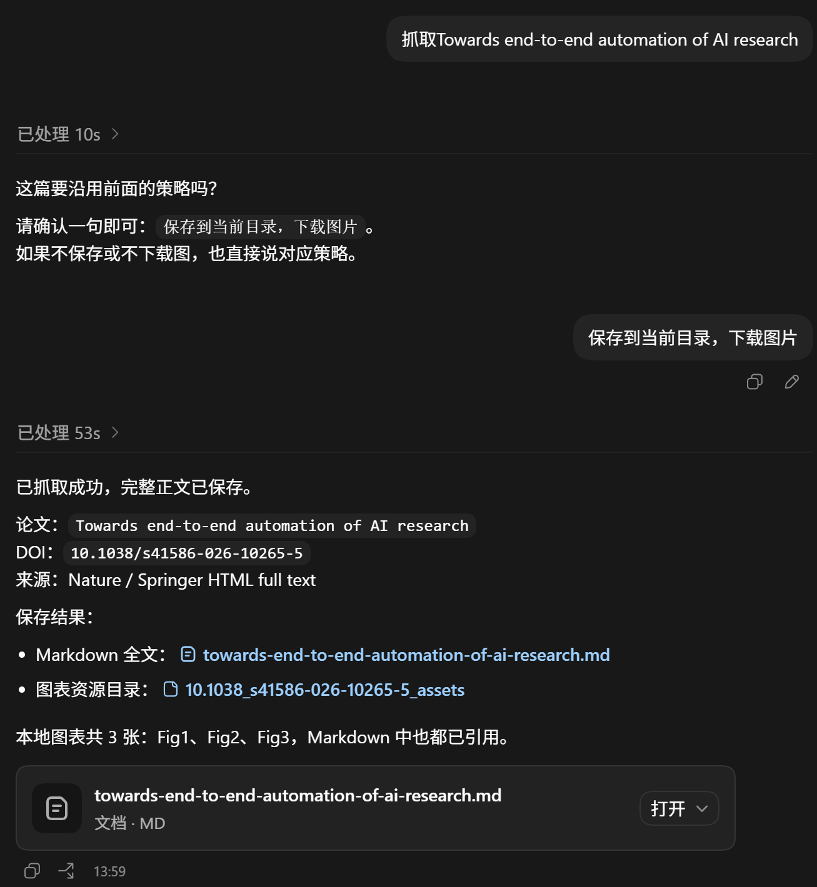
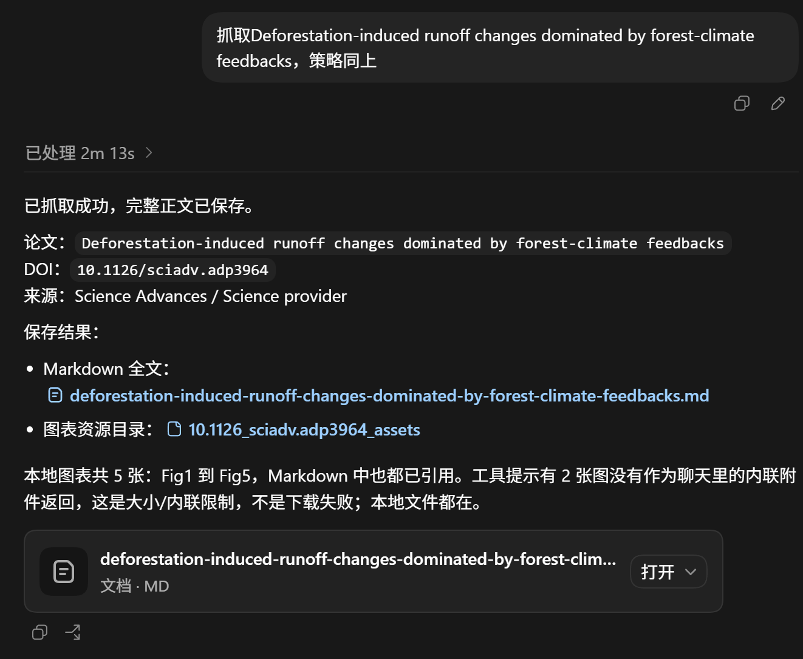

# Paper Fetch Skill

> Fetch papers as agent-ready markdown — DOI/URL/title in, structured full text out. CLI · MCP · Skill.

**Paper Fetch Skill** —— 已知论文的 AI 阅读层。
你输入 DOI、URL 或标题，它返回结构化元数据 + 干净 Markdown 全文 + 图表资源，直接喂给 Codex / Claude Code / 任意 MCP host。
不绕付费墙，只在你本就有访问权限的地方，把 AI 从「只能读摘要」升级到「读全文」。

如果觉得有帮助，欢迎 star⭐ 支持！

## 🙁 AI agent 读论文的痛点

1. 你有权限获取全文，但 AI 没有权限，AI 只能搜到摘要。
2. PDF 无法正确解析文字、图片，agent 理解效果不如 markdown。
3. 文章 html 有很多无关的网页信息，给 agent 造成语义负担和 token 消耗。
4. 文章 html 中的图片 agent 读不到。

## 😍 这个项目做什么

✅这个项目把这些问题收敛到一个工具层：
1. 当你有全文获取权限时，让 AI 也能获取全文，而不仅是摘要。
2. 输入已知论文的 DOI、URL 或标题，抓取 AI 更容易理解的 markdown 版本，为后续知识库构建做好干净的数据基础。

✅项目提供三个主要入口：

1. `paper-fetch`：命令行工具，适合手动大规模快速抓取文献。
2. `paper-fetch-mcp`：stdio MCP server，适合接入 Codex、Claude Code 等支持 MCP 的 host。
3. `skills/paper-fetch-skill/`：静态 agent skill，告诉 agent 什么时候应该调用论文抓取工具。

核心能力：

- 支持 DOI、URL 和标题查询。
- 输出结构化论文元数据、正文 Markdown、引用信息和本地缓存资源。
- 支持 18 个出版社/平台全文 provider，包括 arXiv、Elsevier、Springer、Wiley、Science、PNAS、IEEE、Copernicus、AMS、MDPI、Royal Society Publishing、Annual Reviews、PLOS、Frontiers、Oxford Academic、ACS、IOP 和 AIP。
- 在无法取得全文时返回带警告的仅摘要或仅元数据结果。

项目边界：

- 不替代主题检索、文献推荐或综述生成；开放式搜索可先形成候选，当后续需要阅读、总结、比较、核验可读性或获取全文时，再把 DOI、URL、标题、arXiv ID 或引用条目交给 paper-fetch 抓取和核验候选论文全文。
- 不绕过付费墙或访问授权；可用性取决于 provider、凭据和本机运行环境。
- Wiley、Science、PNAS、Annual Reviews、Royal Society Publishing、ACS、IOP、AIP、MDPI 共用原生 Firefox/Juggler Camoufox browser workflow，见 [`docs/browser-backends.md`](docs/browser-backends.md)。
- 用户可以自行 fork 后添加新出版社，见 [`onboarding/README.md`](onboarding/README.md)，但是需要人工审核确定全文获取、markdown 转换质量等能力。

## 效果展示

agent 安装 skill 后，可以识别 `paper-fetch-skill` 的适用边界，并在抓取前确认是否保存全文和图表资源。



以下示例来自真实开放抓取产物。

### Nature 示例

- 论文：Towards end-to-end automation of AI research
- DOI：`10.1038/s41586-026-10265-5`
- 来源：Springer/Nature HTML full text
- 许可：[`CC BY 4.0`](https://creativecommons.org/licenses/by/4.0)
- Markdown 全文：[`towards-end-to-end-automation-of-ai-research.md`](figures/towards-end-to-end-automation-of-ai-research.md)



### Science Advances 示例

- 论文：Deforestation-induced runoff changes dominated by forest-climate feedbacks
- DOI：`10.1126/sciadv.adp3964`
- 来源：Science Advances / Science provider
- Markdown 全文：[`deforestation-induced-runoff-changes-dominated-by-forest-climate-feedbacks.md`](figures/deforestation-induced-runoff-changes-dominated-by-forest-climate-feedbacks.md)



## 快速开始

### 1. 安装

推荐使用 Releases 里的离线安装包：

- Windows：下载并运行 `paper-fetch-skill-windows-x86_64-setup.exe`。
- Linux：下载匹配 Python ABI 的 `paper-fetch-skill-offline-linux-x86_64-cp*.sh`。
- macOS：在 macOS 15+ Apple Silicon 上下载匹配 Python ABI 的
  `paper-fetch-skill-offline-macos-arm64-cp*.tar.gz`。

每个 `v*` Release 同时提供 `SHA256SUMS`、CycloneDX SBOM 和 GitHub build-provenance attestation。

源码安装按能力分层：

```bash
python -m pip install .             # 轻量 core
python -m pip install ".[browser]"  # Camoufox/HTML
python -m pip install ".[pdf]"      # PDF
python -m pip install ".[full]"     # browser + PDF
uv sync --frozen --extra dev --extra full  # 可复现开发环境
```

core 安装包含 MCP Python SDK 2.x（依赖范围 `mcp>=2,<3`）。`paper-fetch-mcp`
同时服务 2025 握手协议客户端和 2026-07-28 无状态协议客户端；从源码升级后应重新同步
环境并重启 MCP host。

Windows 安装后新开 PowerShell，验证 CLI：

```powershell
paper-fetch --help
```

看到 `usage: paper-fetch ...` 或正常帮助输出即表示 CLI 可用。

Linux 示例：

```bash
python3 --version
chmod +x paper-fetch-skill-offline-linux-x86_64-cp312.sh
./paper-fetch-skill-offline-linux-x86_64-cp312.sh --preset=headless --no-user-config
source ~/.local/share/paper-fetch-skill/activate-offline.sh
paper-fetch --help
```

macOS 示例：

```bash
tar -xzf paper-fetch-skill-offline-macos-arm64-cp312.tar.gz
cd paper-fetch-skill-offline-macos-arm64-cp312
./install-offline.sh --preset=headful --no-user-config
source ~/.local/share/paper-fetch-skill/activate-offline.sh
paper-fetch --help
```

安装器会在修改 shell、skill、MCP 或用户配置前检查 arm64、标准 GIL CPython
ABI 与解释器架构、最低 macOS 15.0、checksum，并递归检查整个 bundle 的
quarantine。安装目标只允许不存在、空目录或带 ownership manifest 和安装标记的
已有目录。若从浏览器下载的 bundle 因 quarantine
被拒绝，请先核验 Release 来源与 `SHA256SUMS`，再按安装器提示显式执行
`xattr -dr com.apple.quarantine <解压后的-bundle>` 后重试；安装器不会静默
绕过 Gatekeeper。

完整安装、升级、卸载和离线包矩阵见 [`docs/deployment.md`](docs/deployment.md)。

### 2. 抓取一篇论文

```bash
paper-fetch --query "10.1186/1471-2105-11-421" --output-dir ./papers
```

未显式传 `--output` 且指定 `--output-dir` 时，CLI 会把主输出写到该目录，不向 stdout 打印正文。默认文件名使用安全化的论文 stem，优先包含作者、年份和标题；元数据不足时回退 DOI，仍无法识别时使用规范化 query 的短 SHA-256 摘要，避免批量任务中的匿名文件名冲突且不暴露完整 URL。需要精确路径时使用 `--output ./papers/article.md`。

### 3. 批量抓取

准备 `queries.txt`：

```text
10.1186/1471-2105-11-421
https://www.nature.com/articles/s41559-026-03039-9
```

运行：

```bash
paper-fetch --query-file ./queries.txt \
  --output-dir ./papers \
  --batch-concurrency 4
```

批量结果会写入 `./papers/batch-results.jsonl`，单篇失败会记录后继续后续条目。完整 CLI 输出、artifact、资产和错误码语义见 [`docs/cli.md`](docs/cli.md)。

## 接入 Agent

| Host | 命令 |
| --- | --- |
| Codex | `./scripts/install-codex-skill.sh --register-mcp` |
| Claude Code | `./scripts/install-claude-skill.sh --register-mcp` |
| Antigravity CLI | `./scripts/install-antigravity-skill.sh --register-mcp` |

带配置文件注册：

```bash
# Linux
./scripts/install-codex-skill.sh --register-mcp --env-file ~/.config/paper-fetch/.env

# macOS
./scripts/install-codex-skill.sh --register-mcp \
  --env-file "$HOME/Library/Application Support/paper-fetch/.env"
```

只安装到当前项目可加 `--project`。安装后重启对应 host，让它重新扫描 skills 和 MCP 配置。手动 MCP 注册和各 host 路径细节见 [`docs/deployment.md`](docs/deployment.md)。

## 常用配置

默认配置文件位置由 `platformdirs` 决定：

```text
Linux: ~/.config/paper-fetch/.env
macOS: ~/Library/Application Support/paper-fetch/.env
```

Linux 创建配置文件：

```bash
mkdir -p ~/.config/paper-fetch
cp .env.example ~/.config/paper-fetch/.env
```

macOS 可用离线安装器的 `--user-config` 合并受管理配置块，或自行创建
`~/Library/Application Support/paper-fetch/.env`。

Elsevier 官方 XML/API 和 PDF fallback 需要从 <https://dev.elsevier.com/> 申请 key：

```bash
ELSEVIER_API_KEY="..."
```

部分 browser-backed provider 需要本机 browser runtime 或手动登录态。离线包只
包含 Camoufox / Playwright 的 Python 包，不包含 Camoufox 浏览器 binary。CLI 的
`fetch`、`auth` 和 `browser-preflight` 在真正需要 managed Camoufox 时默认会显示
进度并按需安装、修复或检查更新；可用 `--no-browser-auto-prepare` 或
`PAPER_FETCH_BROWSER_AUTO_PREPARE=false` 禁止。MCP/库默认不自动联网，需传
`browser_auto_prepare=true` 或用环境变量显式开启。进入受限网络或离线环境前，仍应
在联网状态预置 binary 并运行 preflight：

```bash
source ~/.local/share/paper-fetch-skill/activate-offline.sh
python -m camoufox fetch
paper-fetch browser-preflight
paper-fetch auth wiley
```

不想依赖已激活 shell 时，也可以运行
`~/.local/share/paper-fetch-skill/runtime/paper-fetch-python -m camoufox fetch`。
CLI `browser-preflight` 默认可以完成缺失 runtime 的按需准备；若策略被关闭，必须先
显式运行 `python -m camoufox fetch`。preflight 还会访问出版社页面。当前原生 Mac
验证覆盖 Python 包导入
和在线准备入口，尚未关闭“预置后真正断网启动 Camoufox”的审计项，因此 macOS
tarball 不能被描述为完整离线浏览器包。

当前 browser-backed auth/preflight provider 包括 `wiley`、`science`、`pnas`、`ams`、`mdpi`、`royalsocietypublishing`、`annualreviews`、`acs`、`iop`、`aip`、`tandf`。AMS 默认直接启动 Camoufox 尝试站点的静默 JavaScript 验证；已有 provider storage-state 时会自动复用，静默验证失败时可运行 `paper-fetch auth ams` 完成人工验证并保存状态。T&F 只复用操作者已有的合法浏览器访问状态，不自动登录或绕过 challenge、付费墙。完整 provider、运行时和环境变量说明见 [`docs/providers.md`](docs/providers.md) 与 [`docs/browser-runtime.md`](docs/browser-runtime.md)。

## 文档

- [`docs/deployment.md`](docs/deployment.md)：安装、配置、MCP 注册和更新。
- [`docs/browser-backends.md`](docs/browser-backends.md)：后端选择、Camoufox runtime、headed 认证、离线准备和 live 验收。
- [`docs/cli.md`](docs/cli.md)：CLI 输出、artifact、批量抓取和错误码。
- [`docs/providers.md`](docs/providers.md)：provider 能力、环境变量和运行时配置。
- [`docs/macos-adaptation-changes.md`](docs/macos-adaptation-changes.md)：v4 Mac 适配变更、边界和从 Windows / WSL 同步上游的流程。
- [`docs/macos-adaptation-audit.md`](docs/macos-adaptation-audit.md)：Windows、WSL、原生 Mac 的证据矩阵与开放审计项。
- [`docs/README.md`](docs/README.md)：完整文档导航。
- [`docs/architecture/overview.md`](docs/architecture/overview.md)：架构边界和维护者视角。
- [`onboarding/README.md`](onboarding/README.md)：自助添加新 provider。

## 免责声明

- 获取的文献仅供个人学术研究和学习使用，不得用于商业用途。
- 请遵守所在国家/地区著作权法律法规及所在机构的知识产权政策。
- 本项目不绕过付费墙或访问授权；可用性取决于 provider、凭据和本机运行环境。
- 本项目不存储、分发或传播任何文献内容，仅协助用户定位、抓取或转换用户有权访问的论文内容。
- fixture 中的文献样本仅作为测试使用，严禁对 fixture 进行任何形式的二次分发。
- 使用者应对自身的文献获取和使用行为承担全部责任。

## 社区

<https://linux.do/>
