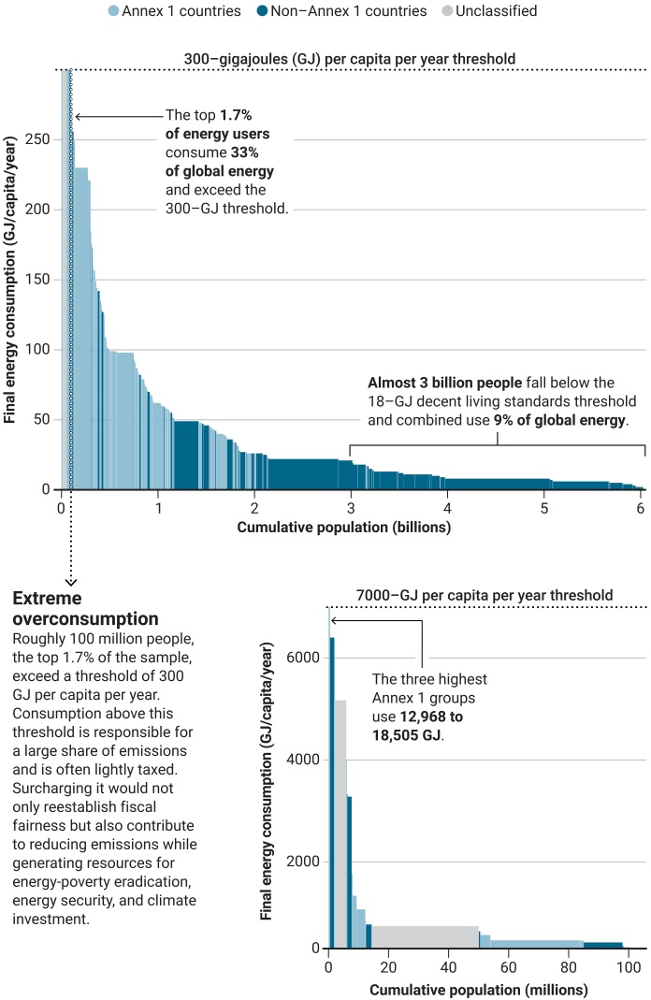

# New demand goals for energy and climate resilience

**Abstract.** Current climate goals, largely focused on energy supply, should be complemented by targeting demand

Current climate goals, insufficient to deliver net-zero emissions by 2050, overlook an underutilized lever of climate action: energy demand1. Traditional energy goals tend to focus on energy supply—primary inputs harnessed from nature—rather than final energy, such as the electricity and fuels delivered to provide services including mobility and thermal comfort. The issue is not lack of interest in demand but the absence of operational, politically legible goals and simple metrics for final energy use and services and for the direct economic and social benefits that they provide. Yet demand is changing: Electrification of end uses (e.g., electric vehicles and heat pumps) is reshaping final energy demand, and electricity-intensive services (e.g., data centers) are boosting loads in some regions. Demand is no longer a passive scenario outcome but a policy variable to steer. We propose integrated demand-side goals to complement supply pledges and advance efficiency, sustainability, and equity by 2035.

Recent global negotiations have only modestly advanced at the United Nations climate conferences COP29 (2024) and COP30 (2025), mainly reaffirming the goals agreed upon already at COP28 in 2023. These negotiated goals include tripling global renewable electricity capacity, doubling energy intensity improvement rates [based on primary energy use per unit of gross domestic product (GDP)], and reducing a third of methane emissions by 2030. These goals are broadly aligned with the International Energy Agency (IEA) roadmap, which emphasizes scaling supply and aligning fossil fuel operations with the Paris Agreement2.

Yet the ultimate driver of the energy system is demand3, the importance of which has been sharpened by war-related disruptions and the resulting energy crisis. Measuring primary energy is fraught with different statistical accounting conventions [see box S1 and fig. S4 in the supplementary materials (SM)] that can increasingly decouple primary energy input trends from the final energy and services rendered to consumers. Unfettered demand growth risks outpacing efforts to achieve universal energy access for all, clean energy, and sustainable supply chains (fig. S5). Current climate goals neglect the growing body of evidence that highlights the transformative potential of demand-side solutions3. These include new business models (e.g., shared mobility and on-demand transport), retrofits, circularity, and behavioral change4. Together, these approaches can rapidly reduce emissions, increase service access, and lower costs, often more effectively than expanding energy supply alone3.

Demand-side action also better addresses the unequal realities of global energy use. Today, more than 700 million people remain without electricity access, many more without reliable and affordable access, and more than 2 billion without clean cooking2. Although only 13 to 18 GJ/year of final energy per capita are required to provide “decent living standards” [minimum service levels of, e.g., housing, travel, and communication, that enable participation in society5], the top 100 million consumers worldwide use in excess of 300 GJ per capita per year, and the top 9 million even use in excess of 2000 GJ per capita per year. This overconsumption drives emissions and constrains the development space and the remaining energy and carbon budget for others, fueling social unrest. It crowds out clean energy deployment for underserved communities while undermining energy affordability and jeopardizing systems resilience and planetary stability.

## Defining Demand-Based Goals

A set of operational goals is required to orient and align efforts at the country and regional levels. An existing framework—widely used in the literature and assessment reports of the Intergovernmental Panel on Climate Change (IPCC)—assesses the contributions to energy and carbon dioxide (CO2) emissions reductions according to their impact on activity (A), structure (S), and intensity (I)3. The ASI framework can link changes in “activity, structure, and intensity” to key policy orientations in “avoiding, shifting, and improving” activities at both economy-wide and sectoral levels6. Hence, it provides a powerful heuristic for ensuring conceptual robustness and operational coherence of the goals. Accordingly, we propose the following three demandfocused goals—one for each dimension of the ASI framework—which should be achieved by 2035. For each goal, we propose a tripling of current efforts, which would put the world on track to align by 2035 with long-term (2050) net-zero and sustainable development pathways. Although our suggested goals are formulated at the global level, they can guide national policy to consider different national circumstances and achieve progress in the three global goals. Given the urgency of energy, climate, and sustainable development goals, national strategies should aim to exceed the global targets wherever possible.

### Intensity

The long-term rate of energy intensity improvements should be at least tripled, aiming for an average rate of 4% annually through 2035. We propose a simple aggregate indicator to measure efficiency: final energy intensity (per unit of GDP). A 4% annual improvement represents a tripling of the 2021 to 2024 average (~1.3% per year), which mirrors both the 2000 to 2010 and the long-term 1950 to 2020 averages7 (fig. S1). The main objective is to support the decoupling of energy and materials demand from economic activities. This goal aligns with and extends the 4% target set at COP28 for achievement by 2030, continuing it through 2035, with a stronger focus on the demand side.

This aggregate goal can be complemented by sector-specific targets aimed at reducing final energy intensity per unit of service—e.g., megajoules per passenger-kilometer, per square meter of conditioned floor space, or per metric ton of materials produced. Given the considerable gap between current performance and best available practices3, the proposed energy intensity goal remains ambitious but feasible. This goal would also catalyze continued learning in granular demand-side technologies—such as heat pumps, battery electric vehicles, and building retrofits—further reducing costs and accelerating progress3.

Tripling energy intensity improvement rates would reduce energy prices and the cost of delivered services by curbing demand growth and avoiding costly supply expansion and infrastructure needs. It would also cut reliance on energy imports, strengthening energy security. These improvements are decisive for meeting climate and environmental targets7 and for making renewable energy expansion more effective and affordable. Without energy intensity enhancement, even record growth in renewables has been outpaced by rising demand, which prevents structural shifts away from fossil fuels and their associated emissions (fig. S5). Any rebound in demand induced by energy intensity improvements (the Jevons paradox) may be desirable where it expands access to essential energy services for those without decent living standards, but it should be curbed among affluent consumers, for instance through higher taxation of excessive final energy use.

### Structure

The rate of growth of the share of electricity in final energy consumption should be tripled to 4% annually through 2035. We propose using the pace of electrification—the annual growth rate of electricity’s share in final energy consumption—as the focal indicator of structural change needed for reaching net-zero targets. A rate of 4% per year triples the 2010 to 2023 average rate (1.3% per year), matches China’s progress over the past two decades, and resembles the global trajectory before the 1980s (fig. S3 and table S1). This rate is consistent with long-term assumptions in decarbonization scenarios (table S2) and would raise electricity’s share in final energy to 33% by 2035 and 60% by 2050, compared with only 24 and 28%, respectively, if past trends (2000 to 2020) continue. These levels align with the Net Zero Emissions (NZE) scenario of the IEA and the Low Energy Demand (LED) scenario (fig. S3), though they are still below the European Union’s target of increasing electrification from 21.3% in 2022 to 32% by 2030, equivalent globally to an annual growth rate above 5%.

Shifts in the composition of energy demand toward less-energy-intensive sectors and more-efficient energy sources and carriers, such as electricity, reduce overall consumption and emissions (box S6). Electrification of end uses, in particular, is a powerful driver of structural change, especially when combined with other infrastructural and behavioral changes: Shifting demand toward public and electrified transport modes, for example, achieves much larger reductions than car fleet electrification alone. A dedicated electrification goal ensures that structural change is explicitly targeted and complements improvements in activity and intensity to deliver the reductions required for net zero.

Tripling the growth of electricity’s share enhances efficiency, by enabling wider use of high-efficiency enduse technologies and lowering service costs; strengthens energy security, by expanding domestically produced renewables in place of imported fossil fuels; and reduces air pollution and climate impacts. Historical evidence of increasing shares of nonfossil energy (fig. S4) and projections of electricity demand and supply (fig. S5) show how accelerated electrification eases capacity needs and makes electricity-sector decarbonization targets by 2035 more achievable. Crucially, accelerated electrification provides the demand pull needed to make the COP28 goal of tripling renewable capacity by 2030 effective, underscoring the complementarity with existing targets.

### Activity

Taxes on energy consumption in excess of 300 GJ/year (final energy per capita) should triple to discourage overconsumption and fund implementation of the energy goals. Energy use is highly unequal, which reflects, among other things, income differences. These differences can be staggering when explicitly considering the high consumption of the wealthiest (see the figure) (box S3 and fig. S6), which is usually “hidden” in aggregate statistics of high-middle-class income categories. Energy use by the wealthiest 1%—notably through private jets, yachts, luxury vehicles, and oversized homes—produces more than twice the CO2 emissions of the poorest 50%8 of the world population combined (box S2).

**Figure** Inequalities in final energy consumption This area chart reflects the distribution of final energy consumption across the global population. Each segment corresponds to a group sharing the same level of per-capita consumption, with segment width proportional to group size. The area of each segment (size of population × per-capita energy consumption) reflects total energy consumed by that group. Segments are sorted by decreasing per-capita consumption. Estimates of consumption from13 were augmented by data from14 to adjust for sample omission bias, particularly at the highest consumption levels, for five Annex 1 and four non–Annex 1 countries. “Unclassified” reflects similar estimates to account for omission bias among the highest consumption levels in all other countries except the nine mentioned above. This combination of data from13 and14 yields a dataset representing 6.1 billion people (~78% of the world population in 2019) and 309 EJ (~74% of the global final energy in 2019). See supplementary materials for details.

We suggest that a threshold of above 300 GJ of final energy per capita per year defines the extreme upper end of high energy use—i.e., energy overconsumption. This threshold corresponds to 100 million people, or roughly the top 2% of the 6.1 billion–people sample (because statistical information is not available for all 8.2 billion people in the world). This benchmark also exceeds the highest thresholds proposed in the energy sufficiency literature (221 GJ per capita per year), with most studies suggesting limits in the range of 60 to 150 GJ per capita per year9. By contrast, decent living standards require just 13 to 18 GJ per capita per year, a level at or below which 50% of the global population currently lives.

High energy consumers currently pay relatively low energy taxes and often none, as in the case of international travel by private planes or yachts. Because luxury energy use (aviation fuel for private jets or fuel for yachts) is often lightly taxed—especially when compared with the $8/GJ to $16/GJ cost of the global consumption–weighted average tax on gasoline, i.e., the fuel of the masses10, 11—and is relatively insensitive to price signals, addressing it offers a critical lever for a fairer, more efficient energy system with lower impacts on the environment and climate.

On the basis of available data10, the upper bound of energy taxes paid by individuals consuming more than 300 GJ per capita is estimated at around $867 billion, excluding fuel costs (box S4). To curb excessive consumption, we propose two surcharge schemes for use above 300 GJ per person per year: (i) a linear levy of $40/GJ, with gross revenue potential of $3 trillion/year, and (ii) alternatively, a progressive levy, with gross revenue potential of $7 trillion/year—roughly the size of global fossil fuel subsidies or ~7% of the 2022 global GDP11 (boxes S4 and S5). Revenues would target energy-poverty eradication, energy security, and climate investment. Preference should be given to incentivize investment through tax credits or by direct government investments. Initial implementation of the proposed tax could focus on luxury fuels (e.g., private aviation kerosene and yacht fuels) and exceptionally high household utility use; a simple “citizen energy card” could help track and tax excess consumption fairly.

Demand responses are uncertain at very high incomes (>$100,000/ year), where observed elasticities are sparse and may be small. Using a range of price elasticities from?0.14 to?0.34 and both tax designs, we estimate excess-use demand reductions of 21 to 53 EJ/year (a third to three-quarters of an estimated 70 EJ/year above-threshold use). These demand reductions also reduce fiscal yield: Depending on elasticity and tax design (linear versus progressive), annual revenues fall to ~$0.2 trillion to 2 trillion/year—a trade-off between cutting overconsumption and generating tax revenues from it.

A 21 to 53 EJ/year reduction—~5 to 12% of 2023 final energy (445 EJ)—would ease pressure on supply (especially oil), dampen price volatility, and free energy to close access gaps (bringing everyone to at least 13 to 18 GJ per capita per year for decent living standards corresponds to an aggregate increase of ~68 EJ/year globally). Even at the lower end, $0.2 trillion to $2 trillion/year could meaningfully finance energy-poverty programs and accelerate efficiency and electrification. Taken together, these three demand goals treat climate gains as a cobenefit of a broader agenda—decent and affordable services for people, resilient economies for nations, and a stable biosphere and climate for all—and offer timely guidance.

## Acting Fast to Avoid the Worst

The proposed goals can be benchmarked using decompositional analysis (box S7) against two prominent decarbonization scenarios: the LED scenario, included in the most recent IPCC report3, and the IEA’s NZE scenario, with respectively more and less demand-side focused changes2 (for details, see table b7-2 in the SM). The proposed intensity improvement (–4% per year) is similar to that in both the NZE and LED scenarios. The electrification target (+4% per year) is slightly below the structural shifts in the LED and NZE scenarios to 2035 (+4.8% per year and +4.7% per year, respectively) but exceeds that of both scenarios after 2035 (below +3% per year). Consistent with this, the resulting CO2 concentrations fall within the LED-NZE envelope by 2050; differences in the range mainly reflect scenario treatment of carbon capture and removal (included in the NZE but not the LED scenario).

Overall, the three proposed goals are consistent with established decarbonization pathways in addition to having historical precedents, which suggests their plausibility and feasibility. These three goals promote more accurate, service-oriented efficiency metrics; redirect attention toward structural and behavioral changes in how energy decouples from product or service demands and supports provisioning of basic services for human needs; and improve health, equity, sustainability, and geopolitical stability by focusing on how domestically produced clean energy powers services that are delivered in an efficient way.

Pursuing these goals in combination unlocks powerful synergies. Enhancing final energy efficiency helps contain demand growth, making it easier to increase the share of electricity in final energy use. Improving efficiency in high-intensity applications with limited direct benefits for well-being—such as Bitcoin mining or data centers—can drive innovation toward more resource-efficient technologies, reduce overconsumption, and prevent crowding out socially vital sectors such as food production. Electrifying services (e.g., mobility, heat, and power for industrial processes) would further enhance efficiency and affordability, particularly by helping to electrify poor households. Including very high personal energy use (above 300 GJ per capita per year) in fiscal contribution reduces overconsumption, improves fiscal fairness, and offers critical support for both the energy efficiency and electrification goals, thereby amplifying the impact of the existing targets on clean energy deployment. A coordinated mix of fiscal, regulatory, and structural measures could meaningfully reduce excessive energy use, opening a decisive window in the coming decade to more fairly realign energy systems with human well-being, economic opportunity, and a safe planetary boundary, while also helping to overcome political challenges12. Researchers, policy analysts, and national and international statistical agencies are invited to join forces to develop and communicate operational concepts for quantification, translation, and monitoring of the proposed goals.

## Figures

Inequalities in final energy consumption This area chart reflects the distribution of final energy consumption across the global population. Each segment corresponds to a group sharing the same level of per-capita consumption, with segment width proportional to group size. The area of each segment (size of population × per-capita energy consumption) reflects total energy consumed by that group. Segments are sorted by decreasing per-capita consumption. Estimates of consumption from ( 13 ) were augmented by data from ( 14 ) to adjust for sample omission bias, particularly at the highest consumption levels, for five Annex 1 and four non–Annex 1 countries. “Unclassified” reflects similar estimates to account for omission bias among the highest consumption levels in all other countries except the nine mentioned above. This combination of data from ( 13 ) and ( 14 ) yields a dataset representing 6.1 billion people (~78% of the world population in 2019) and 309 EJ (~74% of the global final energy in 2019). See supplementary materials for details.

## References (15 total, showing 10)

1. N. Bento et al., Science 383 , 946 (2024).
2. IEA, “World Energy Outlook 2024” (2024); https://www.iea.org/reports/worldenergy-outlook-2024 .
3. F. Creutzig et al., in Climate Change 2022: Mitigation of Climate Change. Contribution of Working Group III to the Sixth Assessment Report of the Intergovernmental Panel on Climate Change , P. R. Shukla et al., Eds. (Cambridge Univ. Press, 2022), pp. 503–612.
4. A. Grubler et al., Nat. Energy 3 , 515 (2018).
5. N. D. Rao, J. Min, Soc. Indic. Res. 138 , 225 (2018).
6. J. Koomey, Z. Schmidt, H. Hummel, J. Weyant, Environ. Model. Softw. 111 , 268 (2019).
7. IEA, “Energy Efficiency 2024” (2024); https://www.iea.org/reports/energy-efficiency-2024 .
8. A. Khalfan et al., Climate Equality: A planet for the 99% (Oxfam International, 2023); https://doi.org/10.21201/2023.000001 .
9. M. J. Burke, Energies 13 , 2444 (2020).
10. M. L. Ross, C. Hazlett, P. Mahdavi, Nat. Energy 2 , 16201 (2017).
